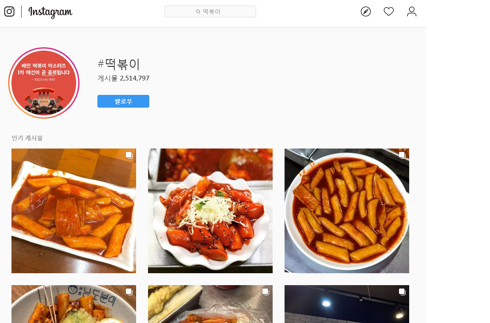

# 냠냠.GG
### 부제:오늘 뭐 먹을까?
<hr/>

냠냠.GG는 **실시간 음식 순위**를 알려주는 사이트입니다.
냠냠.GG는 현재
- 네이버(카카오, 인스타그램은 추후 추가 예정) 검색결과를 바탕으로 현재 인기있는 음식 알려주기
- 내 근처에 먹고 싶은 음식을 잘하는 음식점이 어디있는지 알려주기

이 서비스를 제공하고 있습니다.


# 일반 현황
<hr/>
- 2019 국방부오픈소스아카데미 공개SW 집체교육 WEB분야 산출물
- 인원 : 육군3사관학교 상병 박재형 (API서버, Vue기반 SPA)
- 개발 기간 : '19.10.21 ~ '19.10.25

# 개발 배경
<hr/>
친구들과 같이 놀다가 배고파질때가 있습니다. 이 때 우리는 결정장애에 빠지게 되는 경우가 있습니다.

### 왜 그럴까요?

결정하는데 작용하는 요인이 너무 많기 때문입니다.
이럴 때 쉽게 결정하는 요령이 있습니다. 바로 **통계**를 이용하는 것입니다.
요즘 보면 주변에서 손쉽게 인스타그램, 페이스북 등을 하는 것을 볼 수 있습니다. 또한 이러한 sns에서 음식 사진을 찍고 올리는 것도 자주 볼 수 있습니다.
그렇다면 이러한 게시물 수가 곧 해당 음식의 인기와 비례한다고 볼 수 있습니다.

저는 이를 활용하여, 인스타그램, 다음블로그, 네이버블로그의 게시물 수 통계를 내어 사용자들에게 보여주고 싶었습니다. 그 결과가 바로 **냠냠.GG**입니다.


인스타그램 해시태그

# 제공하는 서비스(스크린샷)


## Project setup
```
npm install


```

### Compiles and hot-reloads for development
```
npm run serve
```

### Customize configuration
See [Configuration Reference](https://cli.vuejs.org/config/).
